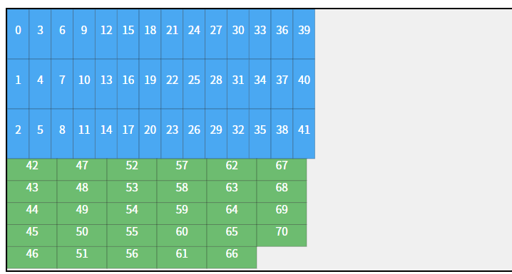
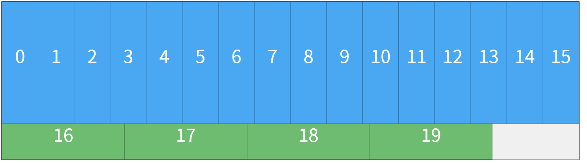
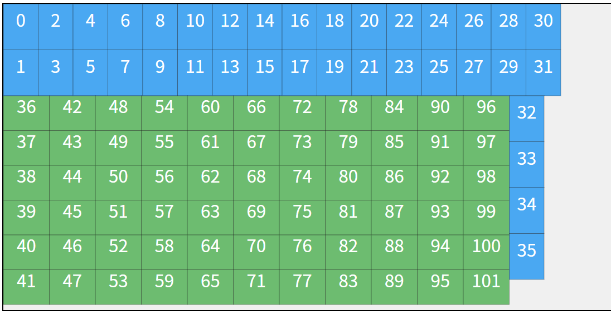
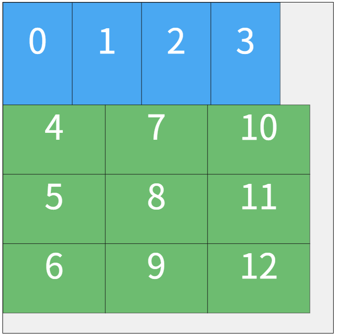

# RectangleBinPack C#

[](https://www.nuget.org/packages/RectangleBinPack.CSharp)
[](https://github.com/juj/RectangleBinPack)

[English Documentation](./README.md)

本项目是 Jukka Jylänki 著名的 C++ 库 [RectangleBinPack](https://github.com/juj/RectangleBinPack) 的 **完整 C# 移植版**。

> **🆕 新特性**: 新增了 `SingleBinPack` 算法，专为大批量单一零件的排版进行优化。

## 📦 包含的算法

本项目忠实还原了原版库中的四大核心算法，并增加了一个针对特定场景优化的算法：

1.  **MaxRects (MaxRectsBinPack)** - 推荐首选，混合零件排版利用率最高。
2.  **Skyline (SkylineBinPack)** - 速度最快，适合实时排样。
3.  **Guillotine (GuillotineBinPack)** - 模拟断头台切割，适合玻璃/金属加工。
4.  **Shelf (ShelfBinPack)** - 简单的层架式布局。
5.  **SingleBin (SingleBinPack)** - **[新增]** 针对单一种类零件的大批量排版优化，支持横竖混合排列以达到极致利用率。

## 🌟 单零件排版示例

新的 `SingleBinPack` 算法能够自动计算最佳的行列组合（横排、竖排或混合排），以在板材上放入尽可能多的同种零件。
|  |  |  |  |

## ⚙️ 算法参数详解

不同的算法提供了多种**启发式策略 (Heuristics)**，选择合适的策略对排样结果至关重要。

### 1. MaxRectsBinPack (最大矩形算法)
初始化：`new MaxRectsBinPack(width, height, allowRotations: true)`
方法：`Insert(w, h, FreeRectChoiceHeuristic)`

| 策略 (FreeRectChoiceHeuristic) | 描述 | 建议 |
| :--- | :--- | :--- |
| **`RectBestShortSideFit`** | **最佳短边拟合**。优先放入放入后剩余短边最小的位置。 | **⭐ 强烈推荐**。通常能获得最高利用率。 |
| `RectBestAreaFit` | **最佳面积拟合**。优先放入放入后剩余面积最小的空闲矩形。 | 某些特定形状组合下可能优于 BSSF。 |
| `RectBottomLeftRule` | **左下角原则**。优先放在最底部，其次最左部（类似俄罗斯方块）。 | 适合需要重心靠下或人类直观理解的场景。 |
| `RectContactPointRule` | **接触点原则**。优先选择与已放置矩形接触边最长的位置。 | 有助于让零件“抱团”，减少碎片。 |
| `RectBestLongSideFit` | **最佳长边拟合**。优先放入放入后剩余长边最小的位置。 | 较少使用，通常效果不如短边拟合。 |

### 2. SkylineBinPack (天际线算法)
初始化：`new SkylineBinPack(width, height, useWasteMap: true)`
方法：`Insert(w, h, LevelChoiceHeuristic)`

| 策略 (LevelChoiceHeuristic) | 描述 |
| :--- | :--- |
| **`LevelBottomLeft`** | **左下角**。在天际线上寻找最低、最左的位置放置。经典策略。 |
| `LevelMinWasteFit` | **最小浪费**。选择放置后由于高度差产生的“被浪费空间”最小的位置。通常比 BottomLeft 更紧凑。 |

### 3. GuillotineBinPack (断头台算法)
初始化：`new GuillotineBinPack(width, height)`
方法：`Insert(w, h, merge, FreeRectChoiceHeuristic, GuillotineSplitHeuristic)`
*此算法需要两个参数：如何选择矩形，以及如何切割剩余空间。*

**A. 选择策略 (FreeRectChoiceHeuristic):**
* `RectBestAreaFit`: 选择面积最合适的空闲区（推荐）。
* `RectBestShortSideFit`: 选择短边最合适的。
* `RectBestLongSideFit`: 选择长边最合适的。
* *(以及对应的 Worst 系列策略，通常不使用)*

**B. 切割策略 (GuillotineSplitHeuristic):**
* **`SplitMinimizeArea`**: **推荐**。切割后优先让较小的那个剩余矩形面积最小（以此保留大块完整区域）。
* `SplitMaximizeArea`: 优先让较大的那个剩余矩形面积最大。
* `SplitShorterLeftoverAxis`: 优先分割后让剩余矩形的短轴更短。
* `SplitLongerLeftoverAxis`: 优先分割后让剩余矩形的长轴更长。

### 4. ShelfBinPack (层架算法)
初始化：`new ShelfBinPack(width, height, useWasteMap: false)`
方法：`Insert(w, h, ShelfChoiceHeuristic)`

| 策略 (ShelfChoiceHeuristic) | 描述 |
| :--- | :--- |
| **`ShelfNextFit`** | **下一层**。如果不适合当前层，就开新层。处理速度最快，逻辑最简单。 |
| `ShelfBestAreaFit` | **最佳面积**。在所有层中寻找剩余面积最适合的层。 |
| `ShelfFirstFit` | **首个适应**。在所有层中，放入第一个能放进去的层。 |
| `ShelfBestHeightFit` | **最佳高度**。选择高度最匹配的层（减少垂直浪费）。 |

## 🚀 安装 (Installation)

本项目已发布到 [NuGet](https://www.nuget.org/packages/RectangleBinPack.CSharp)，推荐通过 NuGet 安装。

### .NET CLI
```bash
dotnet add package RectangleBinPack.CSharp
```
包管理器 (Package Manager)
```PowerShell
Install-Package RectangleBinPack.CSharp
```
💻 使用示例
1. 基础用法 (MaxRects - 混合零件)
```c#
using System;
using System.Collections.Generic;
using RectangleBinPacking;

public class Program
{
    public static void Main()
    {
        // 1. 初始化一个 1024x1024 的板材，允许旋转 (true)
        var packer = new MaxRectsBinPack(1024, 1024, allowRotations: true);

        // 2. 准备要插入的矩形尺寸
        var items = new List<(int w, int h)> 
        { 
            (200, 100), (50, 50), (300, 300), (1000, 500) 
        };

        // 3. 开始排样
        foreach (var item in items)
        {
            // 使用 "最佳短边拟合" 策略 (通常效果最好)
            Rect result = packer.Insert(item.w, item.h, FreeRectChoiceHeuristic.RectBestShortSideFit);

            // 4. 检查结果
            if (result.Height > 0)
            {
                // 判断是否发生了旋转
                bool rotated = result.Width != item.w;
                Console.WriteLine($"成功: Pos({result.X},{result.Y}), Size({result.Width}x{result.Height}), 旋转: {rotated}");
            }
            else
            {
                Console.WriteLine($"失败: 板材已满，无法放入尺寸 {item.w}x{item.h} 的矩形！");
            }
        }
    }
}
```
2. 单零件用法 (SingleBinPack)
当您需要高效排版成千上万个相同尺寸的零件时，请使用此算法。
```c#
using RectangleBinPacking;

// 1. 初始化板材尺寸 (宽, 高)
var singlePacker = new SingleBinPack(3000, 1500);

// 2. 插入 500 个尺寸为 200x100 的零件
// 算法会自动计算最优的横排/竖排组合方案
List<Rect> results = singlePacker.Insert(partWidth: 200, partHeight: 100, quantity: 500);

Console.WriteLine($"成功排入 {results.Count} 个零件。");
foreach(var rect in results)
{
    Console.WriteLine($"零件位置: {rect.X}, {rect.Y} 尺寸: {rect.Width}x{rect.Height}");
}
```
3. 进阶用法 (Skyline + 废料回收)
```c#
// 初始化 Skyline 打包器，启用 WasteMap (第二个参数 true) 以提高利用率
// WasteMap 会自动回收天际线下方形成的封闭空间
var skylinePacker = new SkylineBinPack(2048, 2048, useWasteMap: true);

Rect node = skylinePacker.Insert(200, 150, SkylineBinPack.LevelChoiceHeuristic.LevelBottomLeft);

if (node.Height > 0)
{
    Console.WriteLine($"Skyline 放置位置: {node.X}, {node.Y}");
}
```
📄 许可证
```
Public Domain (Unlicense) 或 MIT 协议。您可以随意修改、分发或商用，无需承担任何法律责任（与原版 C++ 库一致）。
```